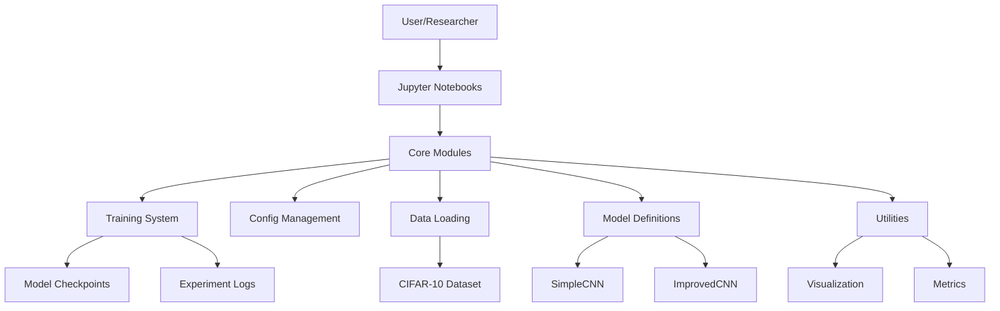
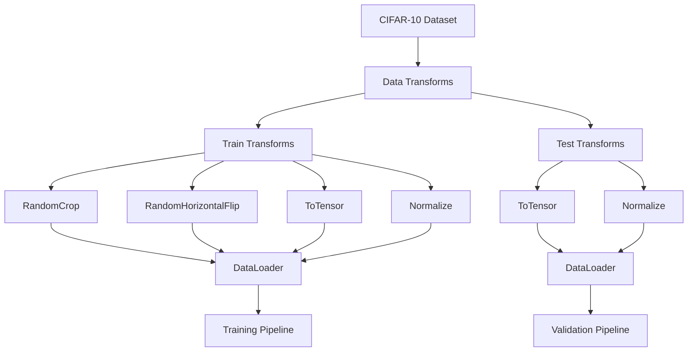
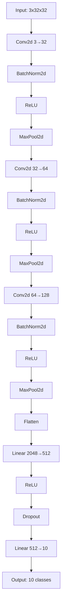
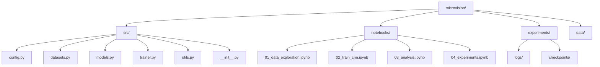
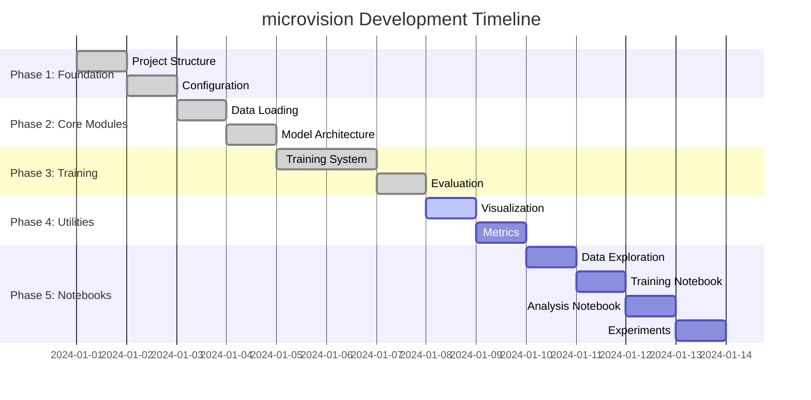
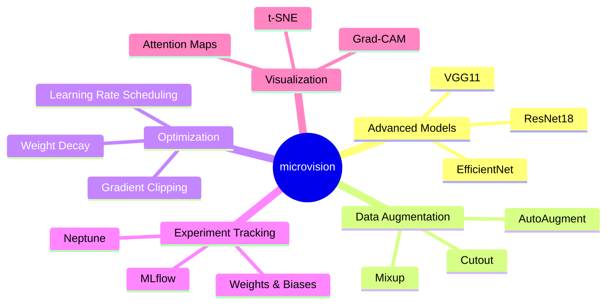

# microvision architecture

## project overview

microvision is a minimal deep learning research lab designed for small-scale vision tasks. built with pytorch, numpy, and managed with uv, it provides a clean, modular framework for computer vision experiments.

## system architecture

### High-Level Architecture

### Module Dependencies

## core components

### 1. Configuration System (`config.py`)

### 2. Data Pipeline (`datasets.py`)

### 3. Model Architecture (`models.py`)

### 4. Training System (`trainer.py`)

## training workflow

### Complete Training Pipeline

### Data Flow

## experiment tracking

### Metrics and Logging

## model performance analysis

### Training Curves

### Loss Curves

## development workflow

### Project Structure

### Development Phases

## usage patterns

### Basic Usage Flow

### Advanced Usage Flow

## key features

### Modularity
- **Config-driven**: All parameters centralized in `Config` class
- **Pluggable models**: Easy model swapping via factory pattern
- **Flexible data**: Support for different datasets and transforms
- **Extensible training**: Custom training loops and metrics

### Reproducibility
- **Fixed seeds**: Deterministic training across runs
- **Version control**: All dependencies locked with uv
- **Checkpointing**: Model state preservation
- **Logging**: Complete experiment tracking

### Performance
- **GPU acceleration**: Automatic device detection
- **Efficient data loading**: Multi-threaded data pipeline
- **Memory optimization**: Gradient checkpointing support
- **Batch processing**: Optimized for small-scale datasets

## metrics and evaluation

### Training Metrics
- **Loss**: Cross-entropy loss with regularization
- **Accuracy**: Top-1 classification accuracy
- **Learning curves**: Training and validation progress
- **Model size**: Parameter count and memory usage

### Visualization Tools
- **Training curves**: Loss and accuracy over time
- **Confusion matrix**: Class-wise performance
- **Sample predictions**: Visual inspection of results
- **Model architecture**: Network structure visualization

## future extensions

### Planned Features

This architecture provides a solid foundation for computer vision research while maintaining simplicity and extensibility. The modular design allows for easy experimentation and rapid prototyping of new ideas.
